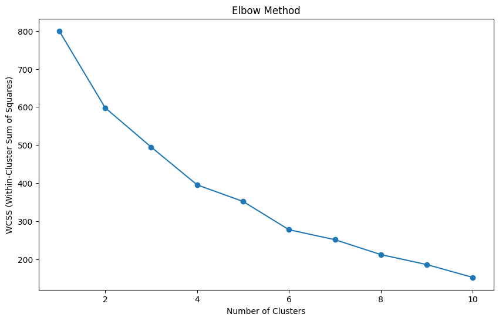
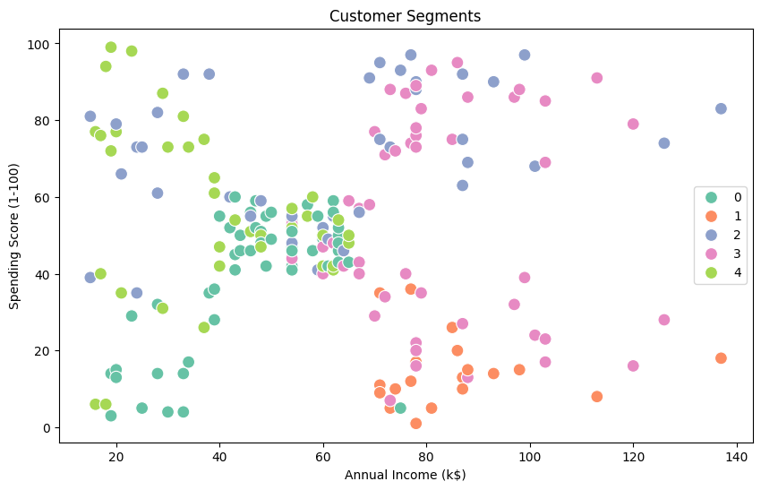

# 🛍️ Customer Segmentation App (PRODIGY_ML_02)

A Streamlit app for customer segmentation using K-Means and DBSCAN clustering, built for the Prodigy ML internship. Upload your own customer data, visualize clusters, and download the trained model.

## 🎥 Demo
Watch the demo to see the app in action:


## 📸 Screenshots
- **Elbow Method for K Selection**: 
- **Cluster Visualization**: 

## 🚀 Try it Now
Access the live app here:  
👉 [https://customer-segment-app.streamlit.app/](https://customer-segment-app.streamlit.app/)

## 🧠 Features
- Customer segmentation using **K-Means** and **DBSCAN**
- Upload your own dataset (CSV with at least `CustomerID` and `Gender` columns)
- Interactive parameter tuning (number of clusters, DBSCAN eps)
- Elbow method plot for optimal K selection
- Silhouette score comparison
- 2D cluster visualization (PCA)
- Download the trained KMeans model (`kmeans_model.pkl`)
- Cluster summary and comparison tables
- User-friendly error handling and UI

## 📦 How to Run the App

### Prerequisites
- Python 3.7+
- pip package manager

### Installation & Setup

1. **Clone the repository:**
```bash
git clone https://github.com/Ayush-Bitla/PRODIGY_ML_02.git
cd PRODIGY_ML_02
```

2. **Install dependencies:**
```bash
pip install -r requirements.txt
```

3. **Run the Streamlit app:**
```bash
streamlit run app.py
```

4. **Access the app:**
The app will open in your default browser at `http://localhost:8501`

### Note on Model File
- The file `kmeans_model.pkl` is generated after you run the app and perform clustering. It is not included by default in the repository.

## 📊 Model & Data Details
- **Algorithms**: K-Means, DBSCAN
- **Dataset**: [Kaggle Customer Segmentation Dataset](https://www.kaggle.com/datasets/vjchoudhary7/customer-segmentation-tutorial-in-python)
- **Features**: Gender, Age, Annual Income, Spending Score
- **Model File**: `kmeans_model.pkl` (downloadable from the app after clustering)

## 🛠️ Project Structure
```
PRODIGY_ML_02/
├── app.py                   # Main Streamlit application
├── kmeans_model.pkl         # Trained KMeans model (generated after running app)
├── Mall_Customers.csv       # Example dataset
├── customer_segments_dbscan.csv # Example output
├── requirements.txt         # Python dependencies
├── CustomerSegmentationDemo.gif # Demo GIF
├── elbow_method.png         # Elbow method screenshot
├── cluster_viz.png          # Cluster visualization screenshot
├── README.md                # This file
```

## 🤝 Contributing
Feel free to submit issues and enhancement requests!

## 📝 License
This project is part of the PRODIGY ML internship program. 
